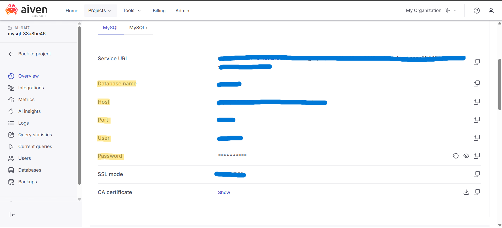

# Projeto 2 - Programação Eficaz
projeto-2-brenda_miqueias created by GitHub Classroom

Brenda de Oliveira Lima , Miqueias Ayron Mamedes Ferreira

## Configurando Variaveis de Ambiente ( .env )
```bash
DB_HOST=<Host>
DB_PORT=<Port>
DB_NAME=<Database name>
DB_USER=<User>
DB_PASSWORD=<Password>
DB_SSL_DISABLED=false
FLASK_ENV=development
```
